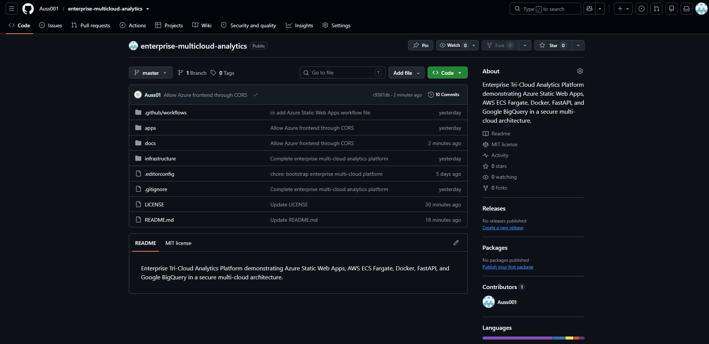
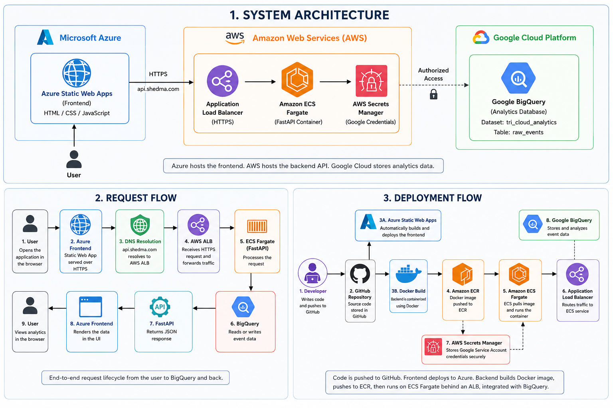
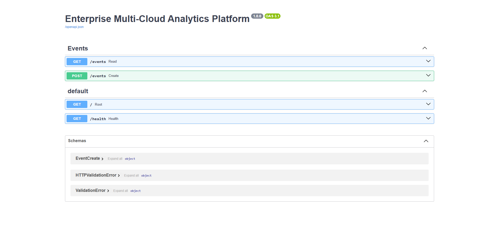
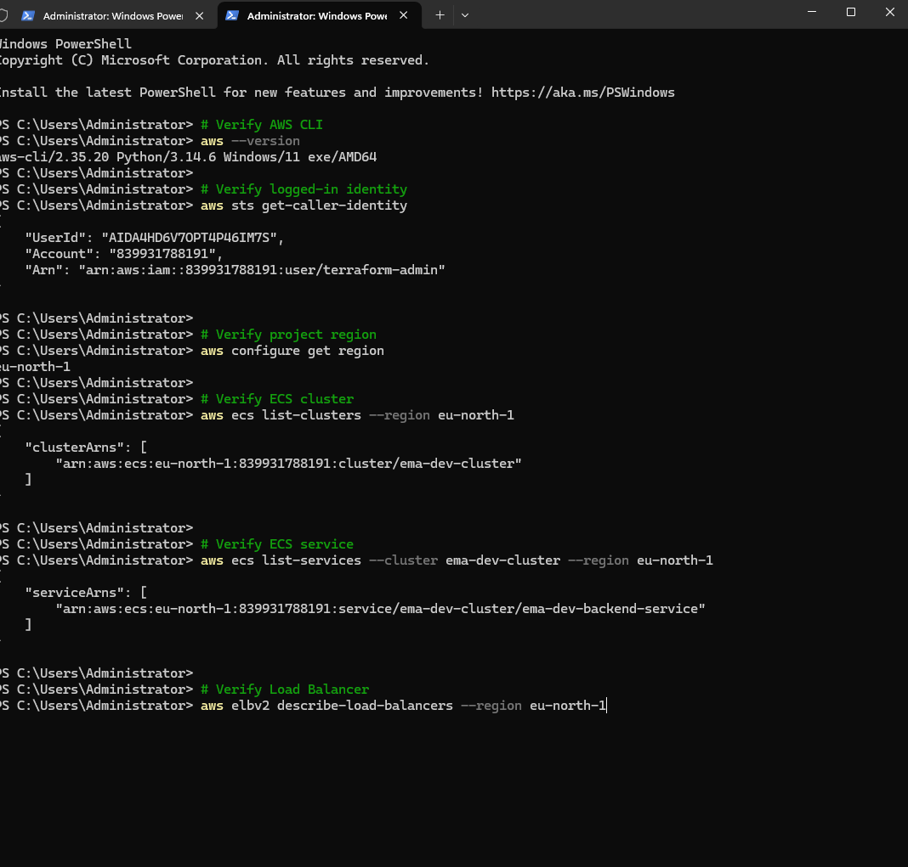
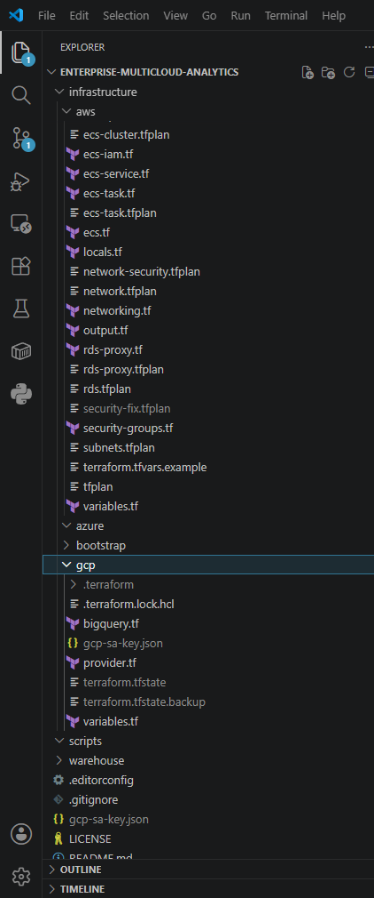
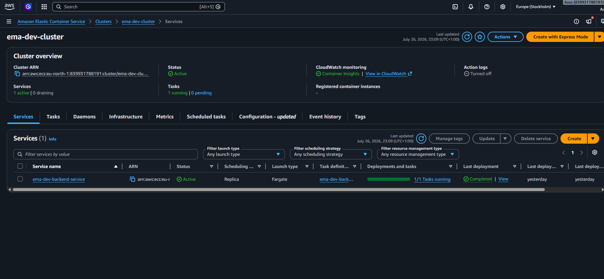
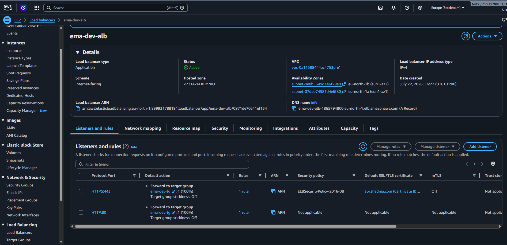
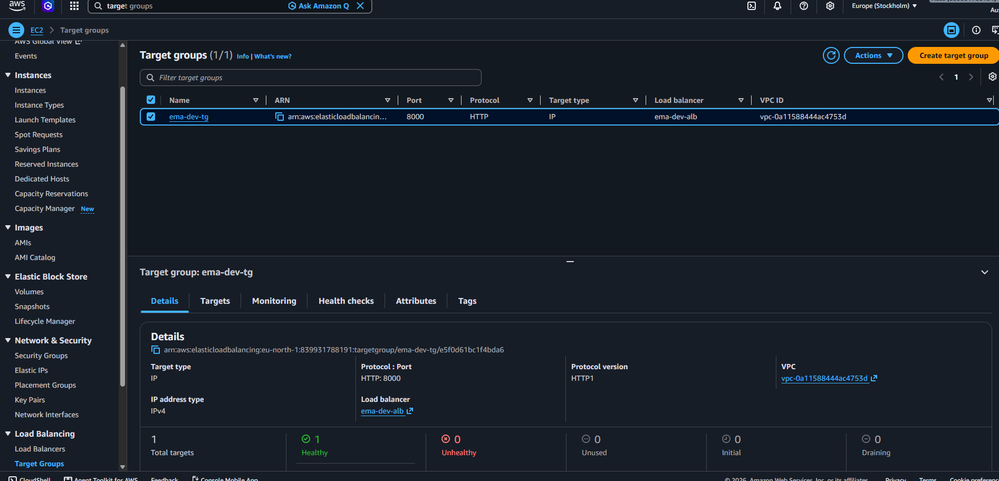
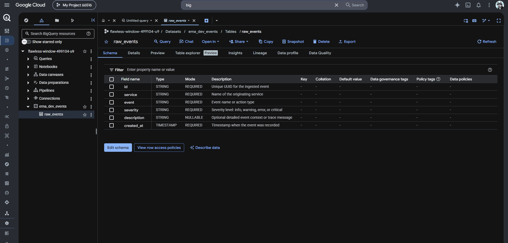
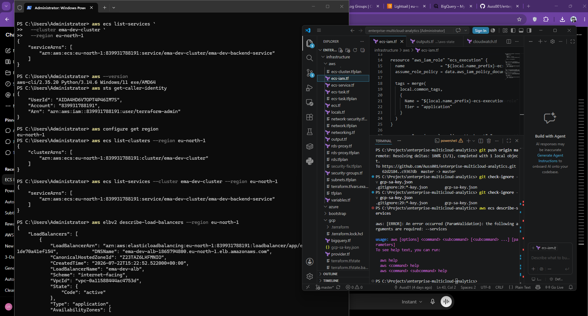

---

# 📸 Project Screenshots

## GitHub Repository

The complete source code, documentation, and Infrastructure as Code for the Enterprise Multi-Cloud Analytics Platform.

---

## System Architecture

High-level architecture showing Azure Static Web Apps, AWS ECS Fargate, FastAPI, Docker, and Google BigQuery working together in a multi-cloud environment.

---

## Live Frontend

The production frontend hosted on Azure Static Web Apps communicating securely with the backend API.

---

## API Documentation

Interactive FastAPI Swagger documentation showing all available REST endpoints.

---

## PowerShell Deployment

Deployment and verification performed using PowerShell, Docker, and the AWS CLI to manage container images and cloud infrastructure.

---

## Terraform Project Structure

Infrastructure as Code organized for Azure, AWS, and Google Cloud using Terraform.

---

## AWS ECS Service

Amazon ECS Fargate service hosting the FastAPI backend with the desired tasks running successfully.

---

## AWS Application Load Balancer

Application Load Balancer routing HTTPS traffic to the backend service.

---

## Target Group Health

Healthy target group confirming successful routing between the load balancer and ECS tasks.

---

## Google BigQuery

Google BigQuery dataset storing application event data generated through the platform.

---

## Engineering Workstation

Development environment showing Visual Studio Code, PowerShell, cloud consoles, and the running application.

