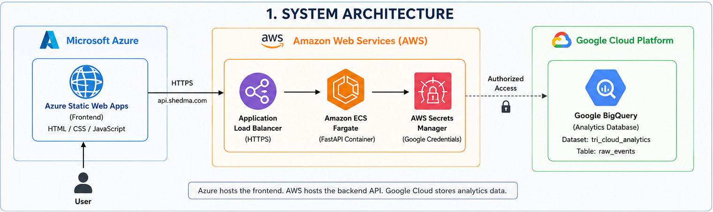
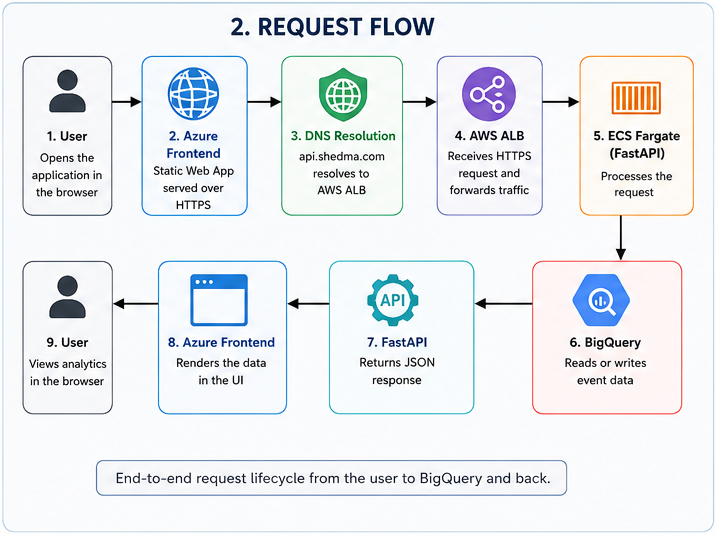
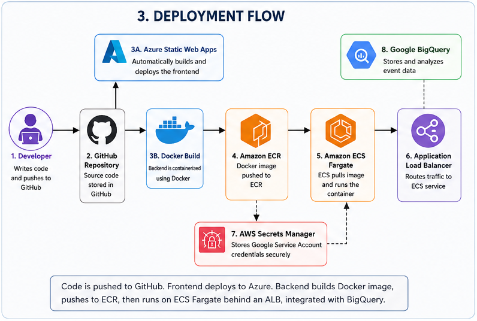

# Architecture

## Overview

The Enterprise Tri-Cloud Analytics Platform is designed as a distributed multi-cloud application, where each cloud provider performs a specific responsibility based on its strengths.

Rather than placing every component inside one cloud provider, the platform demonstrates how enterprise systems can integrate services securely across Microsoft Azure, Amazon Web Services (AWS), and Google Cloud Platform (GCP).

---

# High-Level Architecture

```
                 User Browser
                      │
                      ▼
      Azure Static Web Apps (Frontend)
                      │
                 HTTPS Request
                      │
                      ▼
            api.shedma.com (DNS)
                      │
                      ▼
     AWS Application Load Balancer (HTTPS)
                      │
                      ▼
          Amazon ECS Fargate Service
                      │
                      ▼
             FastAPI REST Application
                      │
         Google Service Account
                      │
                      ▼
         Google BigQuery Dataset
                      │
                      ▼
             JSON API Response
                      │
                      ▼
                User Browser
```

---

# Cloud Responsibilities

## Microsoft Azure

Azure hosts the frontend application.

Responsibilities include:

- Static website hosting
- HTTPS delivery
- GitHub deployment integration
- Global content delivery

Azure serves only static assets.

Business logic is handled elsewhere.

---

## Amazon Web Services

AWS hosts the application backend.

Services used include:

- Amazon ECS Fargate
- Amazon ECR
- Application Load Balancer
- AWS Secrets Manager
- IAM
- CloudWatch

AWS is responsible for:

- Running containers
- Receiving HTTPS traffic
- Authentication
- Logging
- Secure networking

---

## Google Cloud Platform

Google Cloud provides analytical storage.

Services used:

- BigQuery
- Service Accounts

Responsibilities:

- Persist application events
- Execute analytical queries
- Store structured event data

---

# Request Lifecycle

A complete request follows the sequence below.

### Step 1

The browser loads the frontend from Azure Static Web Apps.

---

### Step 2

The frontend sends an HTTPS request to:

```
https://api.shedma.com
```

---

### Step 3

DNS resolves the request.

Traffic reaches the AWS Application Load Balancer.

---

### Step 4

The ALB forwards traffic to Amazon ECS.

---

### Step 5

The ECS Task executes the FastAPI application.

---

### Step 6

FastAPI authenticates with Google Cloud using credentials loaded securely from AWS Secrets Manager.

---

### Step 7

BigQuery stores or retrieves event data.

---

### Step 8

FastAPI returns JSON to the frontend.

---

### Step 9

The frontend renders updated information.

---

# Authentication Flow

Authentication between AWS and Google Cloud is performed securely.

```
Google Service Account
          │
          ▼
AWS Secrets Manager
          │
          ▼
Environment Variable
          │
          ▼
FastAPI
          │
          ▼
BigQuery
```

No Google credentials are stored inside:

- Git
- Docker images
- Source code

---

# Network Architecture

```
Internet
     │
     ▼
Azure Static Web Apps
     │
HTTPS
     ▼
Application Load Balancer
     │
Security Group
     ▼
Amazon ECS
     │
Outbound HTTPS
     ▼
Google BigQuery
```

---

# Security Model

The platform implements several security layers.

## HTTPS

All production traffic uses HTTPS.

---

## TLS

TLS certificates are managed using AWS Certificate Manager.

---

## IAM

AWS IAM controls:

- ECS permissions
- Secrets Manager access
- ECR access
- CloudWatch logging

---

## Secrets Management

Google credentials remain encrypted inside AWS Secrets Manager.

---

## Security Groups

Containers are not directly exposed to the Internet.

Traffic passes only through the Application Load Balancer.

---

## CORS

Only approved frontend origins may communicate with the backend.

---

# Container Architecture

The backend application runs inside a Docker container.

Benefits include:

- Consistent runtime
- Portability
- Simplified deployment
- Cloud independence

Docker images are stored in Amazon ECR before deployment.

---

# Data Architecture

The application stores analytics events.

```
Browser

↓

REST API

↓

FastAPI

↓

BigQuery Dataset

↓

raw_events Table
```

Each event contains:

- id
- service
- event
- severity
- description
- created_at

---

# Scalability

The architecture can be extended through:

- Multiple ECS Tasks
- Auto Scaling
- Multiple Availability Zones
- CloudFront
- Kubernetes
- Additional BigQuery datasets

The current implementation focuses on demonstrating enterprise architecture principles rather than high-volume production workloads.

---

# Design Decisions

Several intentional design decisions were made during development.

| Decision | Reason |
|----------|--------|
| Azure hosts frontend | Simple static hosting with GitHub integration |
| AWS hosts backend | Managed container orchestration using ECS Fargate |
| Google stores analytics | Demonstrates cross-cloud data integration |
| Docker containers | Consistent deployment across environments |
| HTTPS everywhere | Secure communication |
| Secrets Manager | Secure credential storage |

---

# Summary

The Enterprise Tri-Cloud Analytics Platform demonstrates a secure, modular, and maintainable cloud-native architecture spanning three major cloud providers.

The architecture emphasizes:

- Separation of responsibilities
- Secure authentication
- Containerized deployment
- Managed cloud services
- Cost awareness
- Production-style engineering practices
## System Architecture



## Request Flow



## Deployment Flow

